#  弹性布局 （flex布局）

##  一. 认识Flex布局

### Flex布局是什么?

Flex 是 Flexible Box 的缩写，意为"弹性布局"，用来为盒状模型提供最大的灵活性。

### 基本概念

> 采用flex布局的元素，简称容器，容器的所有子元素自动成为容器的成员，简称项目；
> 容器默认存在两根轴：水平的主轴（main axis）和垂直的交叉轴（cross axis）。
> 主轴的开始位置（与边框的交叉点）叫做main start，结束位置叫做main end；
> 交叉轴的开始位置叫做cross start，结束位置叫做cross end。
> 项目默认沿主轴排列。单个项目占据的主轴空间叫做main size，占据的交叉轴空间叫做cross size。
> 容器的6个属性和项目的6个属性，无论作用在flex容器上，还是作用在flex子项，都是控制的flex子项的呈现，只是前者控制的是整体，后者控制的是个体。
>
> 开启Flex布局的元素叫做flex container.
> flex container里面的直接子元素叫做flex items.
>
> 任何一个容器都可以指定为 Flex 布局。
> div{display:flex;}
>
> 行内元素也可以使用 Flex 布局。
> span{display:inline-flex;}
>
> flex 与 inline-flex的区别？
> display: flex; 将对象作为弹性伸缩盒显示，flex容器保持块状特性，宽度默认100%，会像块级元素一样默认占满一行；
> display: inline-flex;将对象作为内联块级弹性伸缩盒显示，inline-flex容器为inline特性，会根据内容自适应宽度,因此可以和图片文字一行显示；
>
> Webkit 内核的浏览器，必须加上-webkit-前缀。移动端不需要加此前缀，但是pc端要加，因为移动端浏览器都是现代浏览器，兼容性好。
> .box{
> display: -webkit-flex; /* Safari */
> display: flex;
> }
>
> 注意，设为 Flex 布局以后，子元素的float、clear和vertical-align属性将失效。
>

### display属性为flex或者inline-flex可以成为flex container

- flex:flex container以block-level形式存在
- inline-flex:flex container以inline-level形式存在

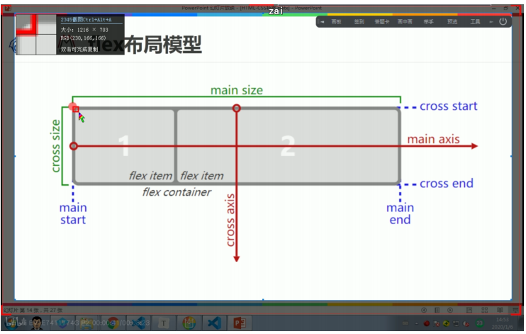

## 二. Flex相关属性

> 容器有6个属性:
> flex-direction:
> flex-wrap
> flex-flow
> justify-content
> align-items
> align-content

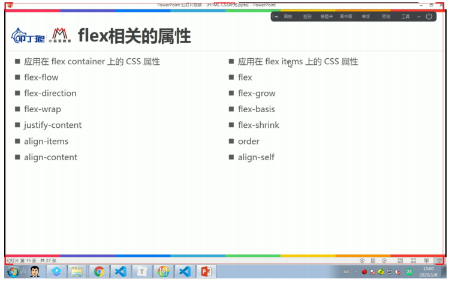

```html
<!DOCTYPE html>
<html>

<head>
	<title>Flex布局显示</title>
	<style type="text/css">
		.container {
			width: 400px;
			height: 400px;
			background-color: orange;
			/* 
			开启flex布局
			flex:块级元素
			inline-flex:行内元素
			 */

			display: flex;

			/* 
				flex-direction:决定主轴上的方向
				row row-reverse column column-reverse
			 */

			/* flex-direction: row; */
			/* 
				justify-content:决定元素在主轴上的对其方式
			 */
			justify-content: stretch;


			/* 在container上未设置主高度时,然后为每个item设置高度,默认是顶部对其,使用align-items的css属性来进行对其
				flex-start
				flex-end
				center
				stretch
				baseline
				 */
			align-items: center;

			/* flex-wrap: wrap; */
			flex-flow: row wrap;

			/* align-content:决定多行flex items在cross axis(交叉轴)上的对其方式,用法与justify-content
 			*/
			align-content: center;
		}

		.item {
			width: 100px;
			height: 100px;
			text-align: center;
			color: white;
		}

		.item1 {
			background-color: red;
			/* height: 50px; */
			/* order:越小就越排在前面(默认值为0),o用的不是特别多
			 */
			order: 1;

			/* align-self: 自己决定自己的对其方式(用的不是特别多)*/
			align-self: flex-end;

			/* flex-grow （默认值是0） grow(成长)*/
			/* flex-shrink (默认值是1)  shrink(缩小)*/
			/* flex-basis (m默认值是auto) 决定flex-items最终的base size的大小(很少使用)*/
			/* flex (默认值是0 1 auto) */

			/* flex-grow :1等同于下面的表达式 */
			flex: 1;
		}

		.item2 {
			background-color: green;
			/* height: 120px; */
		}

		.item3 {
			background-color: blue;
			/* height: 150px; */
		}
	</style>
</head>

<body>
	<div class="container">
		<div class="item item1">item1</div>
		<div class="item item2">item2</div>
		<div class="item item3">item3</div>
	</div>
	<strong>我是一个块元素</strong>
</body>

</html>
```

## 三. flex-direction属性

>  flex-direction属性决定主轴的方向（即项目的排列方向）。

flex-direction: row(默认) | row-reverse | column | column-reverse;
row（默认值）：主轴为水平方向，起点在左端。➡
row-reverse：主轴为水平方向，起点在右端。⬅
column：主轴为垂直方向，起点在上沿。⬇
column-reverse：主轴为垂直方向，起点在下沿。⬆

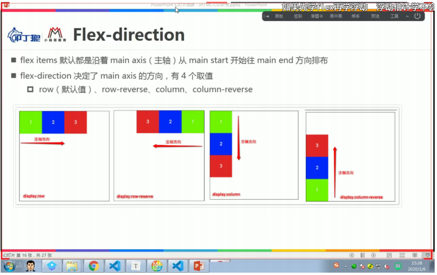

  ```html
<!DOCTYPE html>
<html lang="en">
  <head>
    <meta charset="UTF-8" />
    <meta http-equiv="X-UA-Compatible" content="IE=edge" />
    <meta name="viewport" content="width=device-width, initial-scale=1.0" />
    <title>02-flex-direction属性</title>
    <style type="text/css">
      .container {
        display: flex;
        width: 100vw;
        height: 100wh;

        /* 
        flex-direction:
          row:从左到右(默认)
          row-reverse:从右到左
          column:从上到下
          column-reverse:从下到上
       */
        flex-direction: column-reverse;
      }
      .item {
        margin: 10px 0;
        border-radius: 10%;
        text-align: center;
        line-height: 200px;
      }
    </style>
  </head>
  <body>
    <div class="container">
      <div class="item">元素1</div>
      <div class="item">元素2</div>
      <div class="item">元素3</div>
      <div class="item">元素4</div>
    </div>

    <script>
      const items = document.querySelectorAll(".item");
      for (let i in items) {
        const rand1 = Math.round(Math.random() * 255);
        const rand2 = Math.round(Math.random() * 255);
        const rand3 = Math.round(Math.random() * 255);
        items[i].style.background =
          "rgb(" + rand1 + "," + rand2 + "," + rand3 + ")";
        items[i].style.height = "200px";
        items[i].style.width = "180px";
      }
    </script>
  </body>
</html>

  ```

## 四. justify-conent属性

>  justify-content定义了项目在主轴上的对齐方式。

justify-content:flex-start(默认) | flex-end | center | space-between | space-around | space-evenly(平均分布)
它可能取6个值，具体对齐方式与轴的方向有关。下面假设主轴为从左到右。
flex-start（默认值）：左对齐
flex-end：右对齐
center： 居中
space-between：两端对齐，项目之间的间隔都相等。
space-around：每个项目两侧的间隔相等。所以，项目之间的间隔比项目与边框的间隔大一倍。
space-evenly: 均匀排列每个元素 每个元素之间的间隔相等

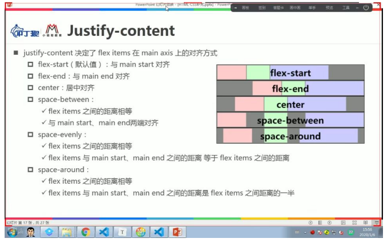

  ```html
<!DOCTYPE html>
<html lang="en">
  <head>
    <meta charset="UTF-8" />
    <meta http-equiv="X-UA-Compatible" content="IE=edge" />
    <meta name="viewport" content="width=device-width, initial-scale=1.0" />
    <title>03-justify-content属性</title>
    <style type="text/css">
      .container {
        display: flex;
        width: 100vw;
        height: 100vh;
        flex-wrap: wrap;

        /* 
        justify-content:
        flex-start(默认) |
        flex-end(右对齐) |
        center(居中) |
        space-between (两端对齐)|
        space-around(两次间隔相等) | 
        space-evenly(平均分布)
         */

        justify-content: space-evenly;
      }
      .item {
        margin: 10px 0;
        border-radius: 10%;
        text-align: center;
        line-height: 200px;
      }
    </style>
  </head>
  <body>
    <div class="container">
      <div class="item">元素1</div>
      <div class="item">元素2</div>
      <div class="item">元素3</div>
      <div class="item">元素4</div>
      <div class="item">元素5</div>
      <div class="item">元素6</div>
    </div>

    <script>
      const items = document.querySelectorAll(".item");
      for (let i in items) {
        const rand1 = Math.round(Math.random() * 255);
        const rand2 = Math.round(Math.random() * 255);
        const rand3 = Math.round(Math.random() * 255);
        items[i].style.background =
          "rgb(" + rand1 + "," + rand2 + "," + rand3 + ")";
        items[i].style.height = "200px";
        items[i].style.width = "180px";
      }
    </script>
  </body>
</html>

  ```


## 五. align-items属性

> align-items定义项目在侧轴上如何对齐。也就是单行轴线上如何对齐，如果flex-wrap的值是wrap时，该属性不起作用。

align-items:strech(默认) | flex-start | flex-end | center | baseline 
它可能取5个值。具体的对齐方式与侧轴的方向有关，下面假设侧轴从上到下:
flex-start：侧轴的起点对齐。
flex-end：侧轴的终点对齐。
center：侧轴的中点对齐。
baseline: 项目的第一行文字的基线对齐。
stretch（默认值）：【如果项目未设置高度或设为auto，将占满整个容器的高度。

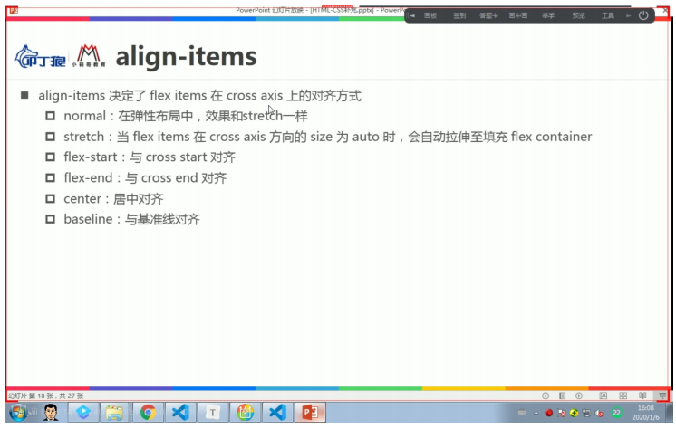

```html
<!DOCTYPE html>
<html lang="en">
  <head>
    <meta charset="UTF-8" />
    <meta http-equiv="X-UA-Compatible" content="IE=edge" />
    <meta name="viewport" content="width=device-width, initial-scale=1.0" />
    <title>04-align-items属性</title>
    <style type="text/css">
      .container {
        display: flex;
        width: 100vw;
        height: 100vh;
        flex-wrap: wrap;
        justify-content: space-evenly;

        /*
        align-items:strech(默认) | flex-start | flex-end | center | baseline 
            它可能取5个值。具体的对齐方式与侧轴的方向有关，下面假设侧轴从上到下:
            flex-start：侧轴的起点对齐。
            flex-end：侧轴的终点对齐。
            center：侧轴的中点对齐。
            baseline: 项目的第一行文字的基线对齐。
            stretch（默认值）：【如果项目未设置高度或设为auto，将占满整个容器的高度。 
        */
        align-items: center;
      }
      .item {
        margin: 10px 0;
        border-radius: 10%;
        text-align: center;
      }
      .item:nth-child(1) {
        height: 50px;
      }
      .item:nth-child(2) {
        height: 150px;
      }
      .item:nth-child(3) {
        height: 90px;
      }
      .item:nth-child(4) {
        height: 50px;
      }
     
    </style>
  </head>
  <body>
    <div class="container">
      <div class="item">元素1</div>
      <div class="item">元素2</div>
      <div class="item">元素3</div>
      <div class="item">元素4</div>
    </div>

    <script>
      const items = document.querySelectorAll(".item");
      for (let i in items) {
        const rand1 = Math.round(Math.random() * 255);
        const rand2 = Math.round(Math.random() * 255);
        const rand3 = Math.round(Math.random() * 255);
        items[i].style.background =
          "rgb(" + rand1 + "," + rand2 + "," + rand3 + ")";
        // items[i].style.height = "200px";
        // items[i].style.width = "180px";
      }
    </script>
  </body>
</html>

```


## 六.  flex-wrap属性

> flex-wrap属性定义项目溢出时如何换行，默认项目都排在一条轴线。注意前提是项目溢出时。

flex-wrap:nowrap(默认) | wrap | wrap-reverse;
！！！flex-wrap属性值是nowrap时，如果项目的宽度加起来溢出了容器的宽度，会压缩项目的宽度使所有项目一排显示。也就是说项目的宽度可能比实际的宽度小。
nowrap（默认）：不换行。
wrap：换行，第一行在上方。
wrap-reverse：换行，第一行在下方。
在设置整体垂直居中时：
当flex-wrap属性值是nowrap时，要和align-items控制【单行】的侧轴对齐方式一起使用，和align-content搭配使用无效。
当flex-wrap属性值是wrap时，要和align-content控制【多行】的侧轴对齐方式一起使用，和align-items搭配使用无效。

```html
<!DOCTYPE html>
<html lang="en">
  <head>
    <meta charset="UTF-8" />
    <meta http-equiv="X-UA-Compatible" content="IE=edge" />
    <meta name="viewport" content="width=device-width, initial-scale=1.0" />
    <title>01-基本使用</title>
    <style type="text/css">
      .container {
        display: flex;
        width: 100vw;
        height: 100vh;

        /* (手机端查看比较好)
        flex-wrap:nowrap(默认) | wrap | wrap-reverse;
        nowrap（默认）：不换行。
        wrap：换行，第一行在上方。
        wrap-reverse：换行，第一行在下方。

        当垂直居中时，如果不换行nowrap,align-items: center; 如果多行wrap,要用align-content: center; 
        */
        flex-wrap: wrap;
      }
      .item {
        margin: 10px 0;
        border-radius: 10%;
        text-align: center;
      }
    </style>
  </head>
  <body>
    <div class="container">
      <div class="item">元素1</div>
      <div class="item">元素2</div>
      <div class="item">元素3</div>
      <div class="item">元素4</div>
      <div class="item">元素5</div>
    </div>

    <script>
      const items = document.querySelectorAll(".item");
      for (let i in items) {
        const rand1 = Math.round(Math.random() * 255);
        const rand2 = Math.round(Math.random() * 255);
        const rand3 = Math.round(Math.random() * 255);
        items[i].style.background =
          "rgb(" + rand1 + "," + rand2 + "," + rand3 + ")";
        // items[i].style.height = "200px";
        items[i].style.width = "180px";
      }
    </script>
  </body>
</html>

```


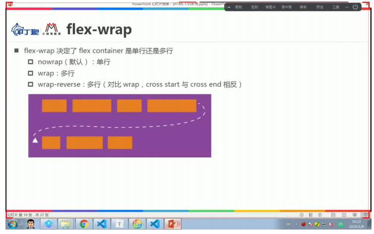


## 七. flex-flow属性

> flex-flow属性是flex-direction属性和flex-wrap属性的简写形式，默认值为row nowrap。
> flex-flow: <flex-direction> || <flex-wrap>;

```html
<!DOCTYPE html>
<html lang="en">
  <head>
    <meta charset="UTF-8" />
    <meta http-equiv="X-UA-Compatible" content="IE=edge" />
    <meta name="viewport" content="width=device-width, initial-scale=1.0" />
    <title>06-flex-flow属性</title>
    <style type="text/css">
      .container {
        display: flex;
        width: 100vw;
        height: 100vh;
        justify-content: space-evenly;
        /* flex-wrap: nowrap;
        flex-direction: row; */

        /* 
        flex-flow: <flex-direction> || <flex-wrap>;
         */

        flex-flow: nowrap column-reverse;
      }
      .item {
        margin: 10px 0;
        border-radius: 10%;
        text-align: center;
        line-height: 200px;
      }
    </style>
  </head>
  <body>
    <div class="container">
      <div class="item">元素1</div>
      <div class="item">元素2</div>
      <div class="item">元素3</div>
      <div class="item">元素4</div>
      <div class="item">元素5</div>
      <div class="item">元素6</div>
    </div>

    <script>
      const items = document.querySelectorAll(".item");
      for (let i in items) {
        const rand1 = Math.round(Math.random() * 255);
        const rand2 = Math.round(Math.random() * 255);
        const rand3 = Math.round(Math.random() * 255);
        items[i].style.background =
          "rgb(" + rand1 + "," + rand2 + "," + rand3 + ")";
        items[i].style.height = "200px";
        items[i].style.width = "180px";
      }
    </script>
  </body>
</html>

```


## 八. align-content属性

> align-content属性定义了多根轴线的对齐方式。如果项目只有一根轴线，该属性不起作用。也就是说，如果flex-wrap的值是nowrap时，该属性不起作用。

align-content:strech(默认) | flex-start | flex-end | center | space-between | space-around
该属性可能取6个值。
flex-start：与侧的起点对齐。
flex-end：与侧轴的终点对齐。
center：与侧轴的中点对齐。
space-between：与侧轴两端对齐，轴线之间的间隔平均分布。
space-around：每根轴线两侧的间隔都相等。所以，轴线之间的间隔比轴线与边框的间隔大一倍。
stretch（默认值）：轴线占满整个交叉轴。

>>项目有6个属性：
>>order
>>flex-grow
>>flex-shrink
>>flex-basis
>>flex
>>align-self

```html
<!DOCTYPE html>
<html lang="en">
  <head>
    <meta charset="UTF-8" />
    <meta http-equiv="X-UA-Compatible" content="IE=edge" />
    <meta name="viewport" content="width=device-width, initial-scale=1.0" />
    <title>01-基本使用</title>
    <style type="text/css">
      .container {
        display: flex;
        width: 100vw;
        height: 100vh;
        flex-wrap: wrap;
        justify-content: space-evenly;

        /*
        align-content:strech(默认) | flex-start | flex-end | center | space-between | space-around
        该属性可能取6个值。
            flex-start：与侧的起点对齐。
            flex-end：与侧轴的终点对齐。
            center：与侧轴的中点对齐。
            space-between：与侧轴两端对齐，轴线之间的间隔平均分布。
            space-around：每根轴线两侧的间隔都相等。所以，轴线之间的间隔比轴线与边框的间隔大一倍。
            stretch（默认值）：轴线占满整个交叉轴。  */
        align-content: space-around;
      }
      .item {
        margin: 10px 0;
        border-radius: 10%;
        text-align: center;
        line-height: 200px;
      }
    </style>
  </head>
  <body>
    <div class="container">
      <div class="item">元素1</div>
      <div class="item">元素2</div>
      <div class="item">元素3</div>
      <div class="item">元素4</div>
      <div class="item">元素5</div>
      <div class="item">元素6</div>
    </div>

    <script>
      const items = document.querySelectorAll(".item");
      for (let i in items) {
        const rand1 = Math.round(Math.random() * 255);
        const rand2 = Math.round(Math.random() * 255);
        const rand3 = Math.round(Math.random() * 255);
        items[i].style.background =
          "rgb(" + rand1 + "," + rand2 + "," + rand3 + ")";
        items[i].style.height = "200px";
        items[i].style.width = "100px";
      }
    </script>
  </body>
</html>

```

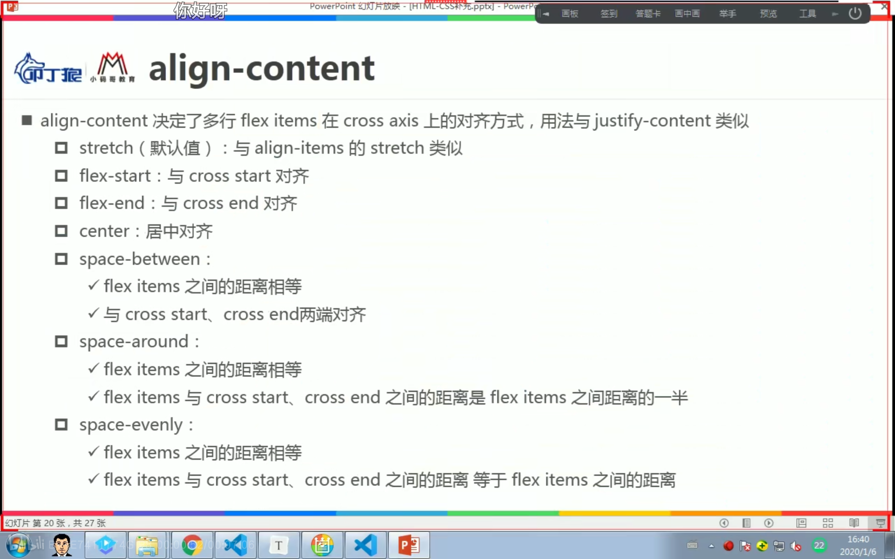


## 九. order属性

order属性
order属性定义项目的排列顺序。数值越小，排列越靠前，默认是0。也可以是负值
order:0（默认） | integer
如果我们想要某一个flex子项在最前面显示，可以设置比0小的整数，如-1就可以了。

```html
<!DOCTYPE html>
<html lang="en">
  <head>
    <meta charset="UTF-8" />
    <meta http-equiv="X-UA-Compatible" content="IE=edge" />
    <meta name="viewport" content="width=device-width, initial-scale=1.0" />
    <title>02-flex-direction属性</title>
    <style type="text/css">
      .container {
        display: flex;
        width: 100vw;
        height: 100vh;
      }
      .item {
        margin: 10px 0;
        border-radius: 10%;
        text-align: center;
        line-height: 200px;
        color: white;
      }

      .item:nth-child(2) {
        /* 决定上面的排布顺序 */
        order: 5;
      }
    </style>
  </head>
  <body>
    <div class="container">
      <div class="item">元素1</div>
      <div class="item">元素2</div>
      <div class="item">元素3</div>
      <div class="item">元素4</div>
    </div>

    <script>
      const items = document.querySelectorAll(".item");
      for (let i in items) {
        const rand1 = Math.round(Math.random() * 255);
        const rand2 = Math.round(Math.random() * 255);
        const rand3 = Math.round(Math.random() * 255);
        items[i].style.background =
          "rgb(" + rand1 + "," + rand2 + "," + rand3 + ")";
        items[i].style.height = "200px";
        items[i].style.width = "180px";
      }
    </script>
  </body>
</html>

```


## 十. align-self属性

align-self属性允许单个项目有与其他项目不一样的对齐方式（即侧轴对齐方式），可覆盖align-items属性。
align-items: auto(默认) | flex-start | flex-end | center | stretch | baseline
该属性可能取6个值，除了auto，其他都与align-items属性完全一致。
默认值为auto，表示继承父元素的align-items属性，如果没有父元素，则等同于stretch。

>>使用flex布局的避坑点：
>>1.注意前缀：display: -webkit-flex; display:flex
>>.demo{
>>display: -webkit-box;      /* OLD - iOS 6-, Safari 3.1-6 */
>>display: -moz-box;         /* OLD - Firefox 19- (buggy but mostly works) */
>>display: -ms-flexbox;      /* TWEENER - IE 10 */
>>display: -webkit-flex;     /* NEW - Chrome */
>>display: flex;             /* NEW, Spec - Opera 12.1, Firefox 20+ */
>>}
>>可以使用autoprefixer插件帮助我们做浏览器兼容

```html
<!DOCTYPE html>
<html lang="en">
  <head>
    <meta charset="UTF-8" />
    <meta http-equiv="X-UA-Compatible" content="IE=edge" />
    <meta name="viewport" content="width=device-width, initial-scale=1.0" />
    <title>09-align-self属性</title>
    <style type="text/css">
      .container {
        display: flex;
        width: 100vw;
        height: 100vh;
        flex-wrap: wrap;
        justify-content: space-evenly;
      }
      .item {
        margin: 10px 0;
        border-radius: 10%;
        text-align: center;
        line-height: 200px;
      }

      .item:nth-child(3) {

        /* 出来的效果跟align-item一样,采用相同的属性值
        align-items:
         auto(默认) | 
         flex-start | 
         flex-end |
          center | 
          stretch | 
          baseline */
        align-self: center;
      }
    </style>
  </head>
  <body>
    <div class="container">
      <div class="item">元素1</div>
      <div class="item">元素2</div>
      <div class="item">元素3</div>
      <div class="item">元素4</div>
      <div class="item">元素5</div>
      <div class="item">元素6</div>
    </div>

    <script>
      const items = document.querySelectorAll(".item");
      for (let i in items) {
        const rand1 = Math.round(Math.random() * 255);
        const rand2 = Math.round(Math.random() * 255);
        const rand3 = Math.round(Math.random() * 255);
        items[i].style.background =
          "rgb(" + rand1 + "," + rand2 + "," + rand3 + ")";
        items[i].style.height = "200px";
        items[i].style.width = "150px";
      }
    </script>
  </body>
</html>

```


2.少用复合属性：比如flex：1，考虑兼容性要拆成flex-grow,flex-shrink,flex-basis

## 十一.  flex-grow属性

1. flex-gorw属性
   flex-grow属性生效的前提是容器的宽度大于所有项目的宽度之和（即容器会有剩余的空间），flex-grow定义项目的放大比例，默认为0，即如果存在剩余空间也不放大。值越大，分配的剩余空间越多。
   flex-grow: 0（默认） | integer
   如果所有项目的flex-grow属性都为1，如果有剩余空间的话则它们将等分剩余空间。如果一个项目的flex-grow属性为2，其他项目都为1，则前者占据的剩余空间将比其他项多一倍。

>>拓展：
>>eg：
>>p{
>>width: 100px;
>>flex-grow: 2;
>>}
>>项目同时设置了width：100px和flex-grow;这里的2不是参照自身，不是自身的2倍，而是剩余空间的宽度/总份数之后得到的平均值 * 2，所以这个项目的最终width是（width + 平均剩余空间 * 2）
>>项目同时设置width和flex-grow时，宽度的计算方法是：
>>step1: 算出容器的宽度
>>step2：算出所有的项目的宽度之和
>>step3：多余的宽度 = 容器的宽度 - 所有的项目的宽度之和
>>step4：平均值 = 多余的宽度 / （所有项目的flex-grow的和）
>>step5：项目的实际宽度 = 项目本来的宽度 +  平均值 * flex-grow的值
>>eg:
>>css部分：

```html
<style>
  *{
    padding: 0;
    margin: 0;
  }
div{
  width: 400px;
  margin: 20px auto;
  height: 200px;
  display: flex;
  box-sizing: border-box;
  border: 2px solid navajowhite;
}
/* p元素同时存在width和flex-shrink时，实际width的计算方法 */
p{
  width: 300px;
  height: 100px;
}
p:nth-child(1){
  background: brown;
}
p:nth-child(2){
  background: yellowgreen;
}
.part1{
  flex-shrink: 1;
}
/* .part1的width是300px，两个p元素的width为600px，但是div的width是400px；所以超出了200px，shrink的均值是200px/4 = 50px，所以.part1的实际width是300-50 = 250px */
.part2{
  flex-shrink: 3;
}
/* .part2的width是300px，两个p元素的width为600px，但是div的width是400px；所以超出了200px，shrink的均值是200px/4 = 50px，所以.part2的实际width是300-50*3 = 150px */
</style>
```

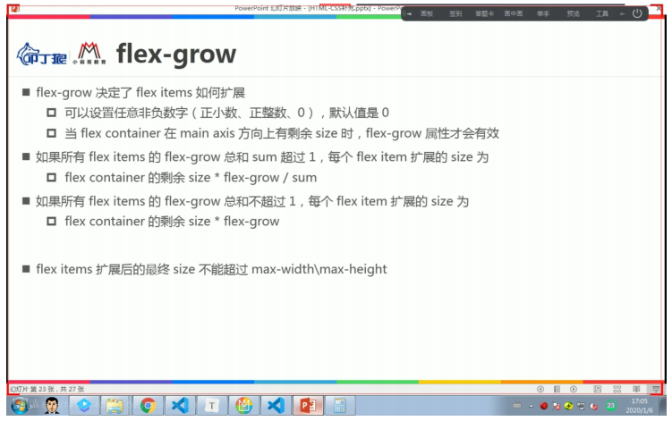


## 十二.  flex-shink属性

3. flex-shrink属性
   flex-shrink属性生效的前提是容器的宽度小于所有项目的宽度之和。flex-shrink定义了项目的缩小比例，默认为1，【即如果空间不足，该项目将缩小。】负值无效。值越大，减小的越厉害。
   flex-shrink: 1（默认） | number
   如果所有项目的flex-shrink属性都为1，当空间不足时，都将等比例缩小。如果一个项目的flex-shrink属性为0，其他项目都为1，则空间不足时，前者不缩小。
   所以在项目宽度加起来超过容器宽度时，项目会自动缩小，因为每个项目的flex-shrink默认为1

>>拓展
>>eg：
>>p{
>>width: 100px;
>>flex-shrink: 2;
>>}
>>项目同时设置了width：100px和flex-shrink：2；这里的值2不是参照自身，而是多出来的宽度的份数，所以实际宽度是（项目的宽度 - 平均值 * flex-shrink的值）
>>项目同时设置width和flex-shrink时，宽度的计算方法是：
>>step1: 算出容器的宽度
>>step2：算出所有的项目的宽度之和
>>step3：超出的宽度 = 所有的项目的宽度之和 - 容器的宽度
>>step4：平均值 = 超出的宽度 / （所有项目的flex-shrink的和）
>>step5：项目的实际宽度 = 项目本来的宽度 - 平均值 * flex-shrink的值

eg：
html部分：

```html
<style>
  *{
    padding: 0;
    margin: 0;
  }
div{
  width: 400px;
  margin: 20px auto;
  height: 200px;
  display: flex;
  box-sizing: border-box;
  border: 2px solid navajowhite;
}
/* p元素同时存在width和flex-shrink时，实际width的计算方法 */
p{
  width: 300px;
  height: 100px;
}
p:nth-child(1){
  background: brown;
}
p:nth-child(2){
  background: yellowgreen;
}
.part1{
  flex-shrink: 1;
}
/* .part1的width是300px，两个p元素的width为600px，但是div的width是400px；所以超出了200px，shrink的均值是200px/4 = 50px，所以.part1的实际width是300-50 = 250px */
.part2{
  flex-shrink: 3;
}
/* .part2的width是300px，两个p元素的width为600px，但是div的width是400px；所以超出了200px，shrink的均值是200px/4 = 50px，所以.part2的实际width是300-50*3 = 150px */
</style>
```

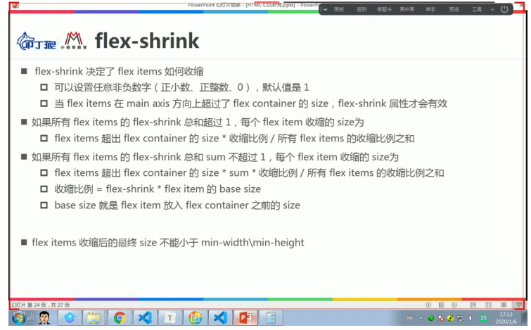


## 十三.  flex-basis属性

flex-basis属性
flex-basis属性定义了在分配多余空间之前，项目占据的主轴空间（main size）。相当于对浏览器提前告知：浏览器兄，我要占据这么大的空间，提前帮我预留好。浏览器根据这个属性，计算主轴是否有多余空间。
flex-basis:auto（默认） | length
flex-basis的默认值为auto，即项目的本来大小。
auto的意思是有设置width则占据空间就是width，没有设置width就按内容的宽度来。
flex-basis可以设为跟width或height属性一样的值（比如350px，%，百分比是按照父元素的width为标准），则项目将占据固定空间。

>>拓展
>>如果项目上同时设置了flex-basis和width，会优先考虑flex-basis（主要成分），会把width忽略掉。
>>当剩余空间不足的时候，flex子项的实际宽度通常并不是设置的flex-basis尺寸，因为flex布局剩余空间不足的时候默认会收缩。

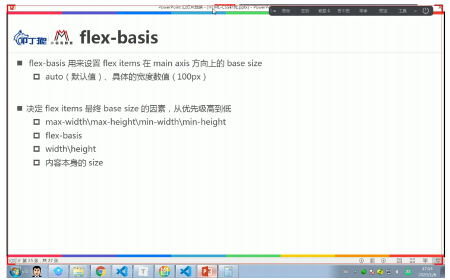

```html
<!DOCTYPE html>
<html lang="en">
  <head>
    <meta charset="UTF-8" />
    <meta http-equiv="X-UA-Compatible" content="IE=edge" />
    <meta name="viewport" content="width=device-width, initial-scale=1.0" />
    <title>12-flex-basis属性</title>
    <style type="text/css">
      .container {
        display: flex;
        width: 100vw;
        height: 100vh;
        flex-wrap: wrap;
        justify-content: space-evenly;
      }
      .item {
        margin: 10px 0;
        border-radius: 10%;
        text-align: center;
        line-height: 200px;
      }

      .item:nth-child(3) {
        flex-basis: 300px;
      }
    </style>
  </head>
  <body>
    <div class="container">
      <div class="item">元素1</div>
      <div class="item">元素2</div>
      <div class="item">元素3</div>
      <div class="item">元素4</div>
     
    </div>

    <script>
      const items = document.querySelectorAll(".item");
      for (let i in items) {
        const rand1 = Math.round(Math.random() * 255);
        const rand2 = Math.round(Math.random() * 255);
        const rand3 = Math.round(Math.random() * 255);
        items[i].style.background =
          "rgb(" + rand1 + "," + rand2 + "," + rand3 + ")";
        items[i].style.height = "200px";
        items[i].style.width = "150px";
      }
    </script>
  </body>
</html>
```


## 十四. flex属性

5. flex属性
   flex属性是flex-grow, flex-shrink 和 flex-basis的简写，默认值为0 1 auto。flex-shrink和flex-basis两个属性可选。
   flex：0 1 auto
   flex：auto (1 1 auto)
   flex: none (0 0 auto)
   该属性有两个快捷值：auto (1 1 auto) 和 none (0 0 auto)。


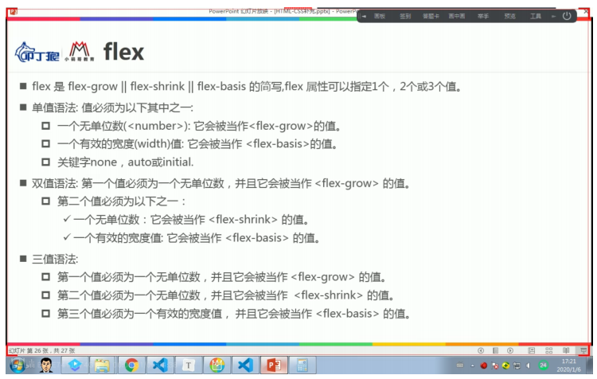


## 十五. 总结


  <div>
    <p class="part1"></p>
    <p class="part2"></p>
  </div>


 <div>
    <p class="part1"></p>
    <p class="part2"></p>
  </div>


6. 